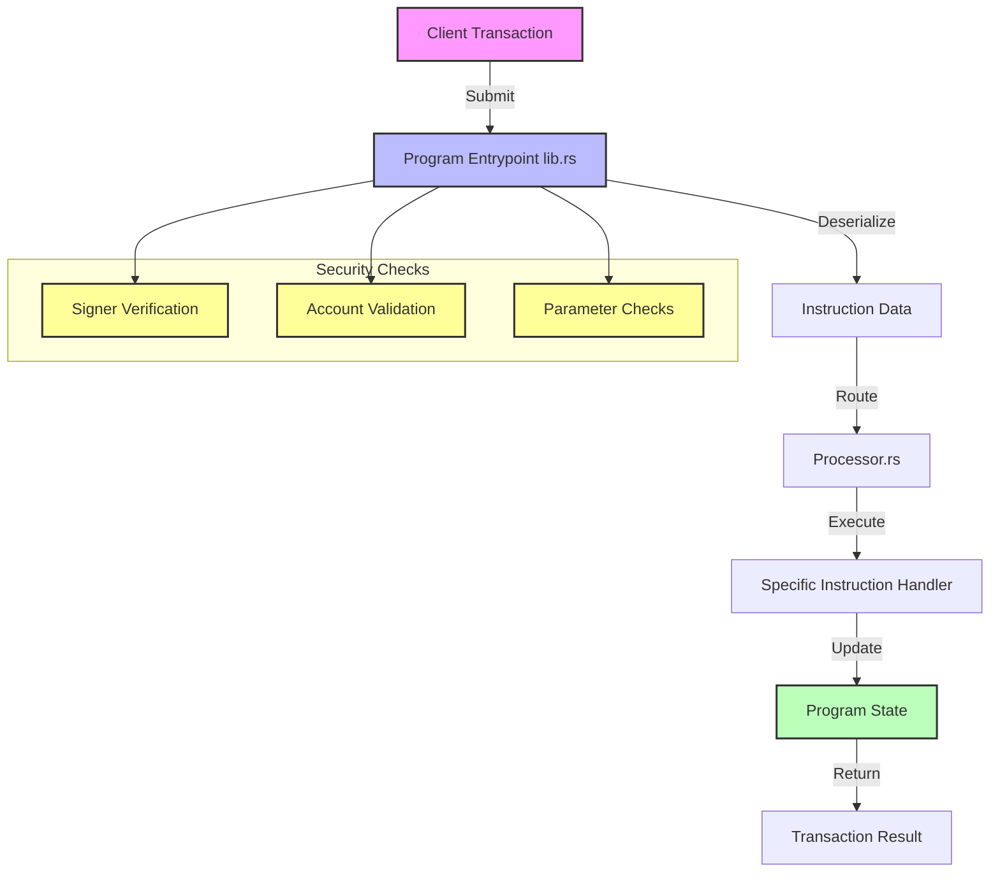
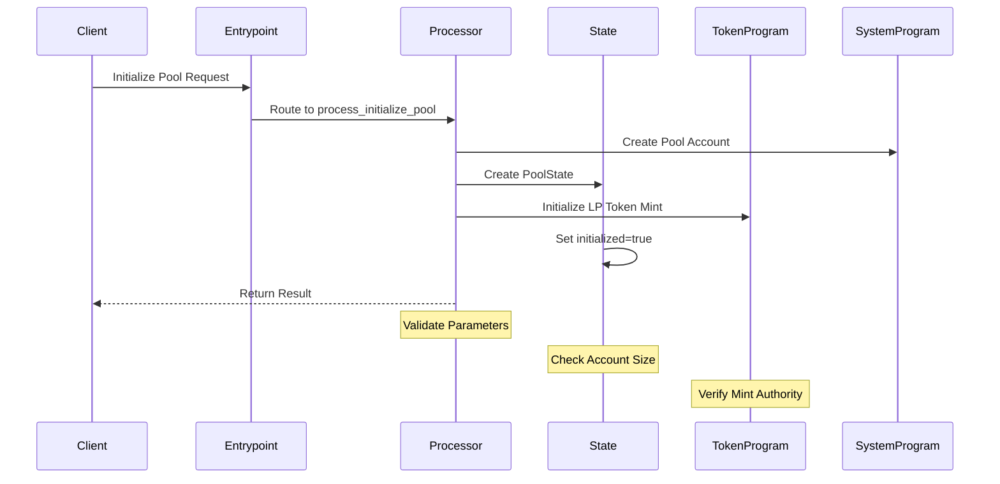
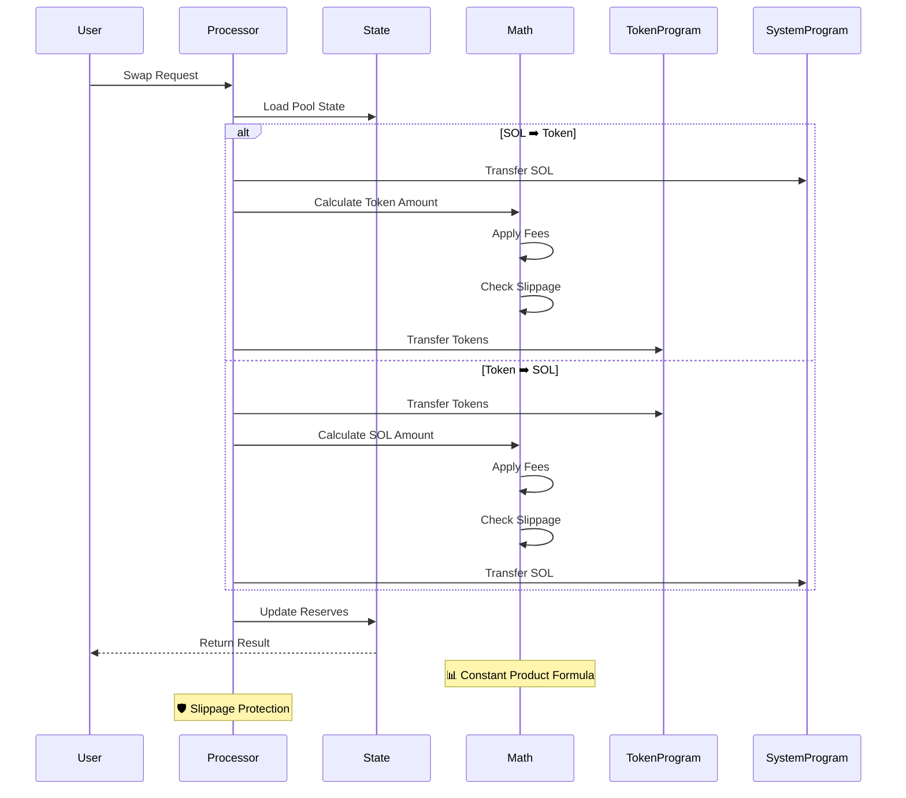
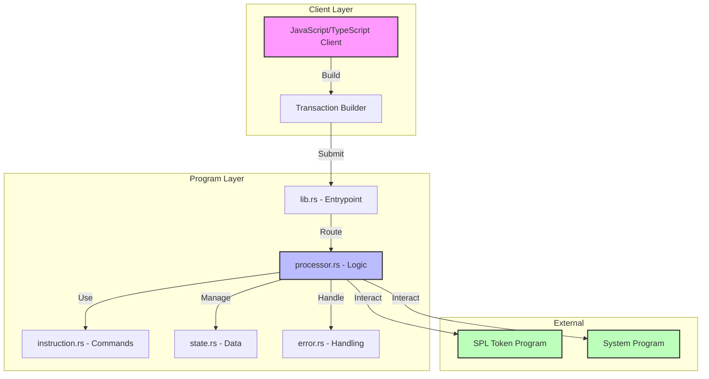
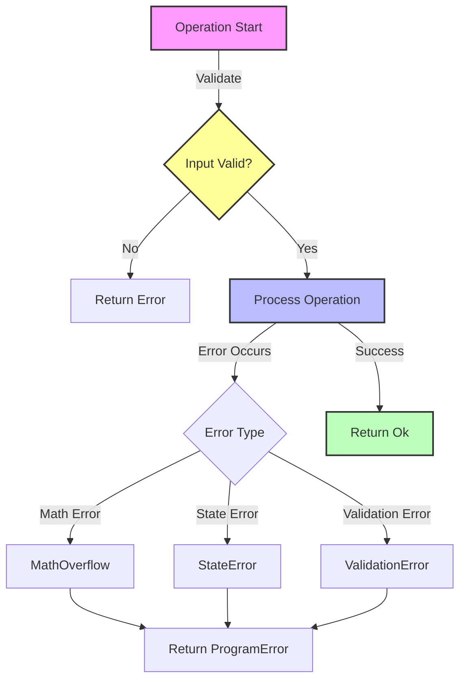

# 🔄 Code Workflow: Simple Token Exchange Program

<div align="center">
  <h3>Visual Guide to Program Flow and Component Interactions</h3>
  <p>Understanding the complete lifecycle of transactions and operations</p>
</div>

---

## 📋 Table of Contents

- [🔄 Code Workflow: Simple Token Exchange Program](#-code-workflow-simple-token-exchange-program)
  - [📋 Table of Contents](#-table-of-contents)
  - [1. Program Entry Flow](#1-program-entry-flow)
  - [2. Instruction Processing Flow](#2-instruction-processing-flow)
    - [🏊‍♂️ Initialize Pool](#️-initialize-pool)
    - [💱 Swap Operation](#-swap-operation)
  - [3. Component Interaction Map](#3-component-interaction-map)
  - [4. Detailed Code Flow](#4-detailed-code-flow)
    - [📝 Transaction Initialization](#-transaction-initialization)
    - [🔄 Instruction Processing](#-instruction-processing)
  - [5. Key Operations Workflow](#5-key-operations-workflow)
    - [🏗️ Pool Initialization Steps](#️-pool-initialization-steps)
    - [💱 Swap Operation Steps](#-swap-operation-steps)
  - [6. Error Handling Flow](#6-error-handling-flow)
  - [7. Security Checkpoints](#7-security-checkpoints)
    - [🔒 Critical Security Checks](#-critical-security-checks)

---

## 1. Program Entry Flow

<div align="center">



</div>

## 2. Instruction Processing Flow

### 🏊‍♂️ Initialize Pool

<div align="center">



</div>

### 💱 Swap Operation

<div align="center">



</div>

## 3. Component Interaction Map

<div align="center">



</div>

## 4. Detailed Code Flow

### 📝 Transaction Initialization

<details>
<summary><strong>1. Client Side Implementation</strong></summary>

```typescript
// Create and submit transaction
const tx = new Transaction().add({
    keys: [...required accounts],
    programId: PROGRAM_ID,
    data: Buffer.from([instruction data])
});
```

</details>

<details>
<summary><strong>2. Program Entry (lib.rs)</strong></summary>

```rust
/// Program entrypoint handler
pub fn process_instruction(
    program_id: &Pubkey,    // Program identifier
    accounts: &[AccountInfo],// Account list
    instruction_data: &[u8], // Instruction data
) -> ProgramResult
```

</details>

### 🔄 Instruction Processing

<details>
<summary><strong>1. Instruction Parsing</strong></summary>

```rust
/// Parse and route instructions
let instruction = TokenExchangeInstruction::unpack(instruction_data)?;
match instruction {
    TokenExchangeInstruction::InitializePool { .. } => { /* ... */ }
    TokenExchangeInstruction::Swap { .. } => { /* ... */ }
    // Other instructions...
}
```

</details>

<details>
<summary><strong>2. State Management</strong></summary>

```rust
// Read current state
let pool_state = PoolState::try_from_slice(&account.data.borrow())?;

// Update state with new values
pool_state.serialize(&mut *account.data.borrow_mut())?;
```

</details>

## 5. Key Operations Workflow

### 🏗️ Pool Initialization Steps

1. **Account Setup**
   - ✅ Validate accounts and permissions
   - 📝 Create pool state account
   - 🔑 Initialize LP token mint

2. **Configuration**
   - 📊 Set initial liquidity parameters
   - 🔒 Mark pool as initialized

### 💱 Swap Operation Steps

1. **Preparation**
   - 📥 Load pool state
   - ✅ Validate input parameters

2. **Execution**
   - 🧮 Calculate swap amounts (constant product)
   - 💰 Apply fees
   - 🛡️ Check slippage tolerance
   - 🔄 Execute token transfers
   - 📝 Update pool reserves

## 6. Error Handling Flow

<div align="center">



</div>

## 7. Security Checkpoints

### 🔒 Critical Security Checks

1. **Account Validation**
   - ✅ Owner verification
   - ✅ Signer verification
   - ✅ Account size validation

2. **Operation Safety**
   - 🛡️ Overflow protection
   - 🛡️ Underflow protection
   - 🔐 Authority verification

3. **Transaction Security**
   - 🔍 Slippage checks
   - 🚫 Reentrancy prevention
   - ⚡ Front-running protection

---

<div align="center">
  <p><i>This workflow documentation is continuously updated to reflect the latest program architecture and security measures.</i></p>
</div>
