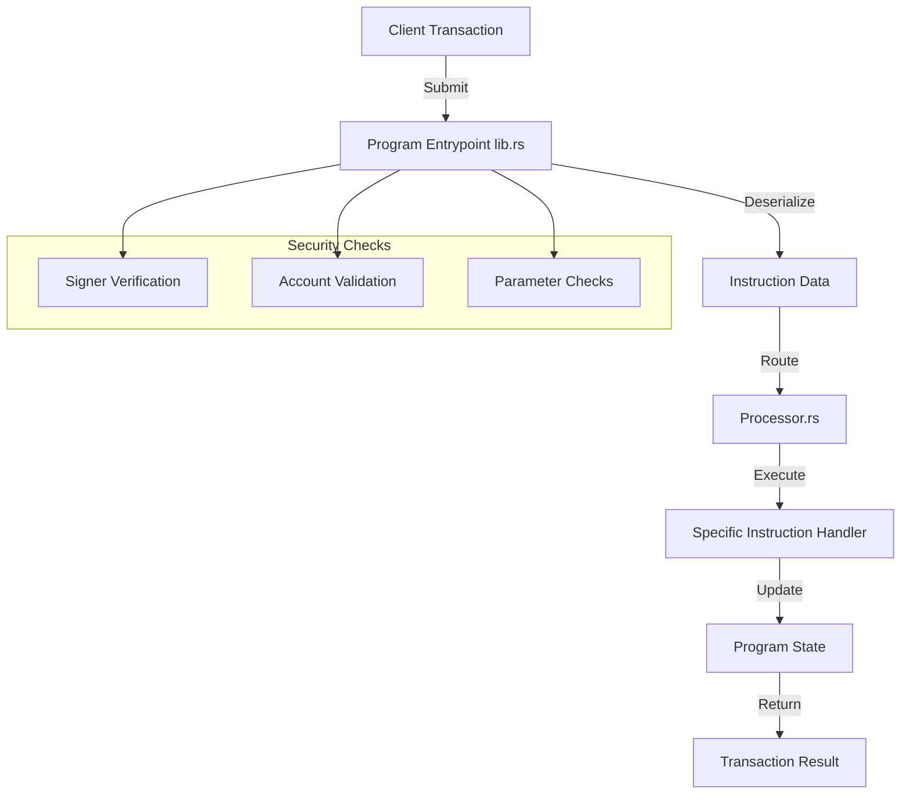
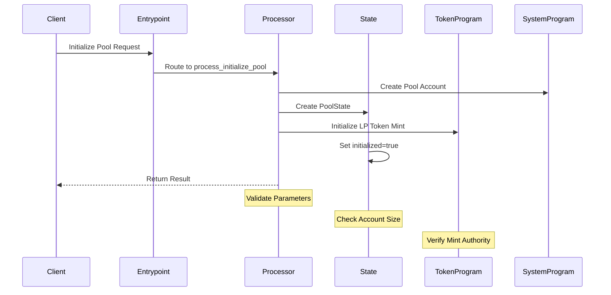
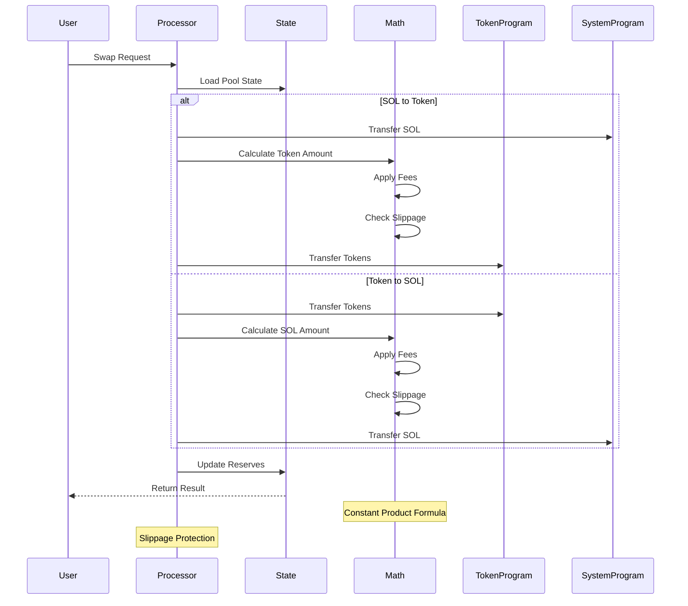
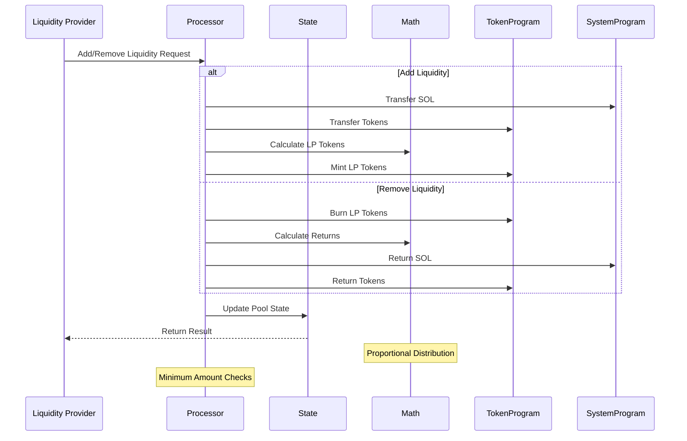
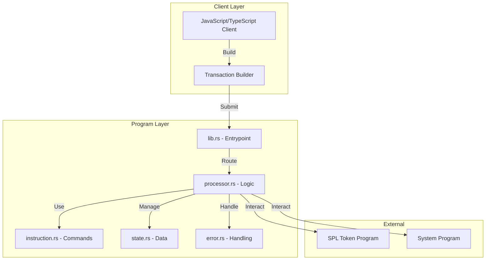
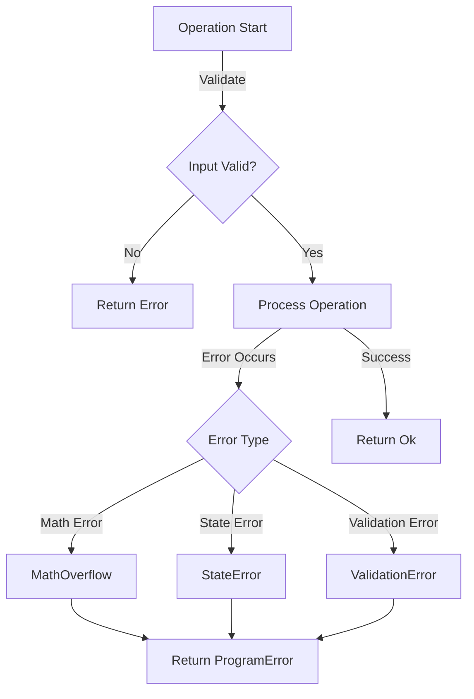
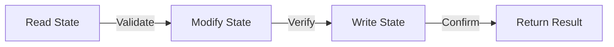
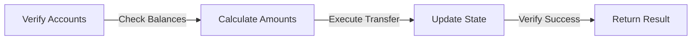

# Code Workflow: Simple Token Exchange Program

## 1. Program Entry Flow



## 2. Instruction Processing Flow

### Initialize Pool



### Swap Operation



### Liquidity Operations



## 3. Component Interaction Map



## 4. Detailed Code Flow

### A. Transaction Initialization

1. **Client Side**

   ```typescript
   // Create transaction
   const tx = new Transaction().add({
       keys: [...required accounts],
       programId: PROGRAM_ID,
       data: Buffer.from([instruction data])
   });
   ```

2. **Program Entry (lib.rs)**

   ```rust
   pub fn process_instruction(
       program_id: &Pubkey,
       accounts: &[AccountInfo],
       instruction_data: &[u8],
   ) -> ProgramResult
   ```

### B. Instruction Processing

1. **Instruction Parsing**

   ```rust
   let instruction = TokenExchangeInstruction::unpack(instruction_data)?;
   match instruction {
       TokenExchangeInstruction::InitializePool { .. } => { ... }
       TokenExchangeInstruction::Swap { .. } => { ... }
       // ... other instructions
   }
   ```

2. **State Management**

   ```rust
   // Read state
   let pool_state = PoolState::try_from_slice(&account.data.borrow())?;
   
   // Update state
   pool_state.serialize(&mut *account.data.borrow_mut())?;
   ```

## 5. Key Operations Workflow

### A. Pool Initialization

1. Validate accounts and permissions
2. Create pool state account
3. Initialize LP token mint
4. Set initial liquidity parameters
5. Mark pool as initialized

### B. Swap Operation

1. Load pool state
2. Validate input parameters
3. Calculate swap amounts using constant product formula
4. Apply fees
5. Check slippage tolerance
6. Execute token transfers
7. Update pool reserves

### C. Liquidity Operations

1. **Adding Liquidity**
   - Calculate proportional amounts
   - Transfer tokens to pool
   - Mint LP tokens
   - Update reserves

2. **Removing Liquidity**
   - Calculate withdrawal amounts
   - Burn LP tokens
   - Transfer tokens to user
   - Update reserves

## 6. Error Handling Flow



## 7. Security Checkpoints

### A. Transaction Level

- Signer verification
- Account ownership checks
- Program ID validation

### B. Operation Level

- Balance checks
- Slippage protection
- Overflow prevention

### C. State Level

- Initialization checks
- Authority verification
- Reserve consistency

## 8. Data Flow Patterns

### A. State Updates



### B. Token Operations



## 9. Testing Workflow

### A. Unit Testing

1. Mock account states
2. Simulate instructions
3. Verify state changes
4. Check error conditions

### B. Integration Testing

1. Deploy to test validator
2. Create test accounts
3. Execute transactions
4. Verify results

## 10. Development Guidelines

### A. Adding New Features

1. Define instruction enum variant
2. Implement processor function
3. Add state management
4. Implement error handling
5. Add tests
6. Update documentation

### B. Modifying Existing Features

1. Review current implementation
2. Identify affected components
3. Update state handling
4. Modify processor logic
5. Update tests
6. Verify backwards compatibility
