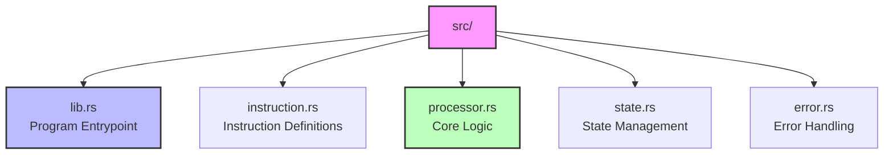
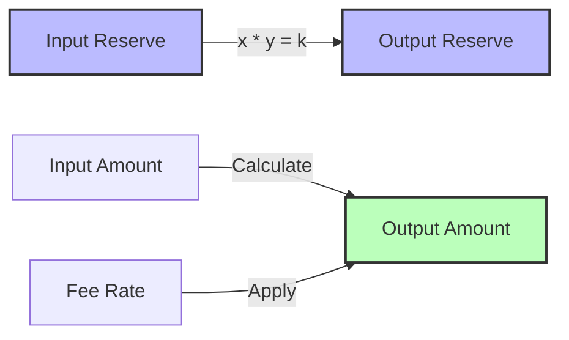

# 👨‍💻 Developer Guide: Simple Token Exchange Program

<div align="center">
  <h3>Technical Implementation Guide for Developers</h3>
  <p><em>Comprehensive guide for implementing and maintaining the token exchange program</em></p>
</div>

---

## 📋 Table of Contents

- [Source Code Structure](#-source-code-structure)
- [Module Details](#-module-details)
- [Implementation Details](#-implementation-details)
- [Testing Guide](#-testing-guide)
- [Development Workflows](#-development-workflows)
- [Best Practices](#-best-practices)

---

## 📁 Source Code Structure

<div align="center">



</div>

## 🔧 Module Details

### 1. Program Entrypoint (lib.rs)

<details>
<summary><strong>Main Program Entry</strong></summary>

```rust
/// Program entrypoint implementation
pub fn process_instruction(
    program_id: &Pubkey,        // Program identifier
    accounts: &[AccountInfo],    // Account list
    instruction_data: &[u8],     // Instruction data
) -> ProgramResult {
    // Instruction processing logic
}
```

**Key Responsibilities:**

- ✅ Entry point validation
- 🔄 Instruction routing
- 🔒 Initial security checks

</details>

### 2. Instructions (instruction.rs)

<details>
<summary><strong>Instruction Definitions</strong></summary>

```rust
/// Program instruction definitions
#[derive(Debug)]
pub enum TokenExchangeInstruction {
    /// Initialize a new pool
    InitializePool {
        sol_amount: u64,     // Initial SOL
        token_amount: u64,   // Initial tokens
        fee_rate: u64,       // Fee percentage
    },
    
    /// Execute token swap
    Swap {
        amount_in: u64,           // Input amount
        minimum_amount_out: u64,  // Minimum output
        is_sol_input: bool,       // Swap direction
    },
    
    /// Add liquidity to pool
    AddLiquidity {
        sol_amount: u64,          // SOL to add
        token_amount: u64,        // Tokens to add
        minimum_lp_tokens: u64,   // Min LP tokens
    },
    
    /// Remove liquidity from pool
    RemoveLiquidity {
        lp_tokens: u64,           // LP tokens to burn
        minimum_sol: u64,         // Min SOL expected
        minimum_token: u64,       // Min tokens expected
    },
}
```

</details>

### 3. Core Logic (processor.rs)

<details>
<summary><strong>Key Processing Functions</strong></summary>

#### Pool Initialization

```rust
/// Initialize a new liquidity pool
fn process_initialize_pool(
    ctx: &ProcessContext,
    sol_amount: u64,
    token_amount: u64,
    fee_rate: u64,
) -> ProgramResult {
    // Validation and initialization logic
}
```

#### Swap Processing

```rust
/// Execute token swap operation
fn process_swap(
    ctx: &ProcessContext,
    amount_in: u64,
    minimum_amount_out: u64,
    is_sol_input: bool,
) -> ProgramResult {
    // Swap execution logic
}
```

#### AMM Calculations

```rust
/// Calculate swap output amount
fn calculate_output_amount(
    amount_in: u64,
    reserve_in: u64,
    reserve_out: u64,
    fee_rate: u64,
) -> Result<u64, ProgramError> {
    // Constant product formula implementation
}
```

</details>

### 4. State Management (state.rs)

<details>
<summary><strong>Program State Structures</strong></summary>

```rust
/// Pool state definition
#[derive(BorshSerialize, BorshDeserialize, Debug)]
pub struct PoolState {
    pub authority: Pubkey,      // Pool administrator
    pub sol_reserve: u64,       // SOL balance
    pub token_reserve: u64,     // Token balance
    pub lp_mint: Pubkey,        // LP token mint
    pub fee_rate: u64,          // Fee percentage
    pub token_mint: Pubkey,     // Token mint address
    pub initialized: bool,       // Pool status
}

impl PoolState {
    /// Calculate required account size
    pub const LEN: usize = /* size calculation */;
    
    /// Create new pool state
    pub fn new(/* params */) -> Self {
        // Initialization logic
    }
}
```

</details>

### 5. Error Handling (error.rs)

<details>
<summary><strong>Custom Error Types</strong></summary>

```rust
/// Program-specific error types
#[derive(Debug)]
pub enum TokenExchangeError {
    #[error("Invalid instruction")]
    InvalidInstruction,
    
    #[error("Pool already initialized")]
    PoolAlreadyInitialized,
    
    #[error("Pool not initialized")]
    PoolNotInitialized,
    
    #[error("Insufficient liquidity")]
    InsufficientLiquidity,
    
    #[error("Slippage tolerance exceeded")]
    SlippageExceeded,
    
    // Additional error types...
}
```

</details>

## 🔍 Implementation Details

### Constant Product AMM

<div align="center">



</div>

```rust
/// Calculate swap output with fees
fn calculate_swap_output(
    amount_in: u64,
    reserve_in: u64,
    reserve_out: u64,
    fee_rate: u64,
) -> Result<u64, ProgramError> {
    // Apply fee
    let amount_in_with_fee = amount_in
        .checked_mul(10000 - fee_rate)?
        .checked_div(10000)?;
    
    // Calculate output (y = (x * k) / (x + dx))
    let numerator = reserve_out
        .checked_mul(amount_in_with_fee)?;
    let denominator = reserve_in
        .checked_add(amount_in_with_fee)?;
    
    numerator
        .checked_div(denominator)
        .ok_or(ProgramError::ArithmeticOverflow)
}
```

### Security Implementation

#### 1. Overflow Protection

```rust
// Safe arithmetic operations
let new_reserve = pool_state.sol_reserve
    .checked_add(amount_in)
    .ok_or(TokenExchangeError::MathOverflow)?;
```

#### 2. Account Validation

```rust
// Verify account ownership and signing
if !initializer.is_signer {
    return Err(ProgramError::MissingRequiredSignature);
}

if *pool_account.owner != program_id {
    return Err(ProgramError::InvalidAccountOwner);
}
```

#### 3. Slippage Protection

```rust
// Enforce minimum output amount
if calculated_amount < minimum_amount_out {
    return Err(TokenExchangeError::SlippageExceeded.into());
}
```

## 🧪 Testing Guide

### Unit Testing

<details>
<summary><strong>Test Implementation Examples</strong></summary>

```rust
#[cfg(test)]
mod tests {
    use super::*;
    
    #[test]
    fn test_initialize_pool() {
        // Arrange
        let program_id = Pubkey::new_unique();
        let accounts = create_test_accounts();
        
        // Act
        let result = process_initialize_pool(
            &accounts,
            &program_id,
            1000,
            1000,
            30,
        );
        
        // Assert
        assert!(result.is_ok());
        // Additional assertions...
    }
    
    #[test]
    fn test_swap_calculation() {
        // Test cases for swap math
    }
}
```

</details>

### Integration Testing

<details>
<summary><strong>E2E Test Examples</strong></summary>

```typescript
// Client-side integration test
describe('Token Exchange Integration', () => {
    it('should execute swap successfully', async () => {
        // Setup
        const pool = await createTestPool();
        
        // Execute
        const result = await pool.swap({
            amountIn: new BN(1000000),
            minimumOut: new BN(900000),
            isSolInput: true,
        });
        
        // Verify
        expect(result.success).toBe(true);
        // Additional checks...
    });
});
```

</details>

## 🔄 Development Workflows

### 1. Feature Implementation

1. **Planning**
   - ✏️ Design instruction interface
   - 📝 Document requirements
   - 🔍 Identify dependencies

2. **Implementation**
   - 🛠️ Add instruction variant
   - ⚙️ Implement processor logic
   - 🔒 Add security checks
   - ✅ Write tests

3. **Review & Testing**
   - 🧪 Run test suite
   - 📊 Verify edge cases
   - 🔍 Code review
   - 📝 Update docs

### 2. Debugging Process

1. **Issue Investigation**
   - 📝 Add logging statements
   - 🔍 Check program logs
   - ✅ Verify account states

2. **Resolution**
   - 🛠️ Fix identified issues
   - ✅ Add regression tests
   - 📝 Document fixes

## ✨ Best Practices

### Code Quality

| Practice | Description | Priority |
|----------|-------------|----------|
| Documentation | Clear comments and docs | 🔴 High |
| Error Handling | Descriptive errors | 🔴 High |
| Testing | Comprehensive tests | 🔴 High |
| Security | Proper validation | 🔴 High |

### Security Checklist

- ✅ Use checked arithmetic
- ✅ Validate all accounts
- ✅ Implement slippage checks
- ✅ Verify signers
- ✅ Handle edge cases

---

<div align="center">
  <p><em>This guide is continuously updated with the latest development practices and security measures.</em></p>
  <p>Last updated: February 2024</p>
</div>
