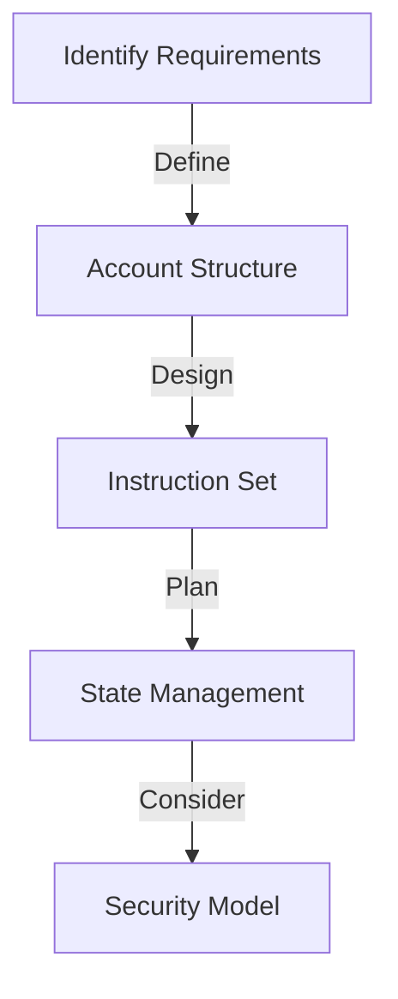

# 🧠 Solana Program Developer's Mindset Guide

<div align="center">
  <h3>Essential Principles and Thinking Patterns</h3>
  <p><em>A guide to developing the right mindset for Solana program development</em></p>
</div>

## 📋 Table of Contents

1. [Core Principles](#-core-principles)
2. [Security Mindset](#-security-mindset)
3. [Performance Thinking](#-performance-thinking)
4. [Development Flow](#-development-flow)
5. [Common Pitfalls](#-common-pitfalls)
6. [Best Practices](#-best-practices)

## 🎯 Core Principles

### 1. Account Model First

```rust
// Always think in terms of accounts
pub struct AccountContext {
    pub user: AccountInfo,      // Who is performing the action?
    pub pool: AccountInfo,      // What state is being modified?
    pub token_a: AccountInfo,   // What tokens are involved?
    pub token_b: AccountInfo,   // What other accounts are needed?
}
```

**Remember:**

- ✅ Every action needs specific accounts
- ✅ Accounts hold program state
- ✅ Account ownership is crucial
- ✅ PDAs are powerful tools

### 2. Stateless Processing

```rust
// Programs are stateless - state lives in accounts
pub fn process_instruction(
    program_id: &Pubkey,
    accounts: &[AccountInfo],
    instruction_data: &[u8],
) -> ProgramResult {
    // Process based on provided accounts and data
}
```

**Key Points:**

- 🔄 Programs only process instructions
- 💾 State must be loaded from accounts
- 📝 Changes must be explicitly saved
- 🔒 State persistence is critical

## 🔒 Security Mindset

### 1. Trust Nothing

```rust
// Always validate everything
fn validate_accounts(accounts: &[AccountInfo]) -> ProgramResult {
    // ✅ Check account ownership
    if account.owner != expected_owner {
        return Err(ProgramError::InvalidAccountOwner);
    }
    
    // ✅ Verify signers
    if !account.is_signer {
        return Err(ProgramError::MissingRequiredSignature);
    }
    
    // ✅ Validate account data
    if account.data_len() != EXPECTED_SIZE {
        return Err(ProgramError::InvalidAccountData);
    }
}
```

### 2. Think Like an Attacker

- 🔍 What if accounts are swapped?
- 💰 Can funds be drained?
- 🔄 Is reentrancy possible?
- 🔑 Are permissions checked?

## 🚀 Performance Thinking

### 1. Computational Limits

```rust
// Remember: You have limited compute units
fn efficient_processing() {
    // ✅ Minimize loops
    // ✅ Avoid expensive calculations
    // ✅ Use efficient data structures
    // ✅ Optimize account access
}
```

### 2. Resource Management

- 💾 Minimize account size
- 🔄 Batch operations when possible
- 📊 Use appropriate data types
- 🚫 Avoid redundant storage

## 🔄 Development Flow

### 1. Planning Phase



### 2. Implementation Flow

1. **Define Accounts**

   ```rust
   // Start with account structures
   pub struct PoolAccounts {
       pub state: AccountInfo,
       pub authority: AccountInfo,
       pub vault: AccountInfo,
   }
   ```

2. **Create Instructions**

   ```rust
   // Define clear instructions
   pub enum Instruction {
       Initialize { params: InitParams },
       Execute { data: ExecuteData },
   }
   ```

3. **Implement Processing**

   ```rust
   // Process step by step
   fn process_instruction(/* params */) -> ProgramResult {
       // 1. Validate accounts
       // 2. Load state
       // 3. Process logic
       // 4. Update state
       // 5. Handle errors
   }
   ```

## ⚠️ Common Pitfalls

### 1. Security Issues

- ❌ Insufficient validation
- ❌ Missing signer checks
- ❌ Unsafe arithmetic
- ❌ Unprotected state updates

### 2. Performance Issues

- ❌ Unnecessary loops
- ❌ Inefficient data structures
- ❌ Excessive account loading
- ❌ Redundant validations

## ✨ Best Practices

### 1. Code Organization

```rust
// Keep code modular and clear
mod state;      // Account structures
mod instruction;// Instruction definitions
mod processor; // Processing logic
mod error;     // Error definitions
mod validation;// Validation functions
```

### 2. Error Handling

```rust
// Define clear error types
#[derive(Error, Debug)]
pub enum ProgramError {
    #[error("Invalid account owner")]
    InvalidOwner,
    
    #[error("Insufficient funds")]
    InsufficientFunds,
    
    // Add specific error types
}
```

### 3. Testing Strategy

```rust
// Test at multiple levels
#[cfg(test)]
mod tests {
    // Unit tests
    #[test]
    fn test_validation() {}
    
    // Integration tests
    #[test]
    fn test_full_flow() {}
    
    // Error case tests
    #[test]
    fn test_error_conditions() {}
}
```

## 🎓 Learning Path

1. **Start Small**
   - Build simple programs first
   - Master account handling
   - Understand PDAs thoroughly

2. **Grow Gradually**
   - Add complexity step by step
   - Focus on security
   - Learn from existing programs

3. **Master Advanced Concepts**
   - Cross-program invocation
   - Complex account structures
   - Advanced security patterns

## 🔍 Daily Checklist

Before deploying any changes:

- [ ] All accounts validated
- [ ] Security checks in place
- [ ] Error handling complete
- [ ] Tests written and passing
- [ ] Performance optimized
- [ ] Documentation updated

---

<div align="center">
  <p><em>Remember: Solana development is about thinking in accounts, prioritizing security, and optimizing performance.</em></p>
  <p>Last updated: February 2024</p>
</div>
