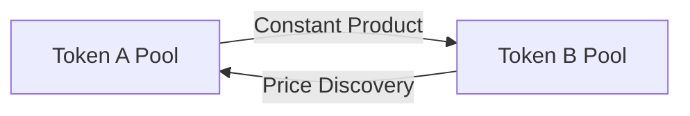
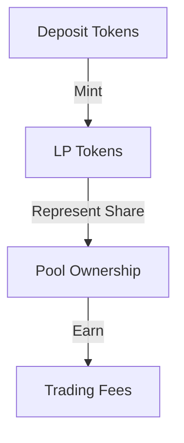

# 📖 Learning Guide: Simple Token Exchange Program

## 🎯 Educational Purpose

This token exchange program is designed as a learning tool to understand:

- Solana program development
- DeFi concepts
- Smart contract security
- Token economics

## 🎓 Learning Path

### 1. Prerequisites

```rust
// Required knowledge
- Basic Rust syntax and ownership model
- Solana account model
- Public key cryptography basics
- DeFi fundamentals
```

### 2. Core Concepts

#### A. Solana Program Structure

```rust
// Basic program structure
pub fn process_instruction(
    program_id: &Pubkey,    // Learn: Program identification
    accounts: &[AccountInfo],// Learn: Account management
    instruction_data: &[u8], // Learn: Data serialization
) -> ProgramResult
```

#### B. Account Model

```rust
// Understanding PDA (Program Derived Address)
let (pool_address, bump_seed) = Pubkey::find_program_address(
    &[b"pool", authority.key.as_ref()],
    program_id
);
// Learn: How PDAs work and why they're used
```

### 3. Key Learning Components

#### A. Constant Product AMM

```rust
// Understanding the math
fn calculate_output_amount(
    amount_in: u64,
    reserve_in: u64,
    reserve_out: u64,
) -> u64 {
    // Learn: x * y = k formula
    // Learn: Price impact
    (reserve_out * amount_in) / (reserve_in + amount_in)
}
```

#### B. Liquidity Pool Management

```rust
// Understanding liquidity provision
fn calculate_lp_tokens(
    sol_amount: u64,
    token_amount: u64,
    total_supply: u64,
) -> u64 {
    // Learn: Proportional ownership
    // Learn: Fair value calculation
}
```

## 🔍 Study Guide by Topic

### 1. Program Architecture

- **Entry Point (lib.rs)**
  - Learn how Solana programs receive instructions
  - Understand program deployment and upgrades

- **Instructions (instruction.rs)**
  - Study command pattern implementation
  - Learn parameter validation techniques

- **State Management (state.rs)**
  - Understand account data storage
  - Learn about serialization with Borsh

### 2. DeFi Concepts

#### A. Automated Market Maker (AMM)



#### B. Liquidity Provider Mechanics



### 3. Security Patterns

#### A. Common Vulnerabilities

```rust
// Example: Integer Overflow Protection
let new_amount = amount_a
    .checked_add(amount_b)
    .ok_or(ErrorCode::MathOverflow)?;
```

#### B. Security Checklist

- [ ] Input validation
- [ ] Arithmetic overflow checks
- [ ] Authority verification
- [ ] Slippage protection

## 🛠️ Hands-on Exercises

### 1. Basic Operations

```typescript
// Exercise 1: Initialize a pool
async function initializePool() {
    // TODO: Create necessary accounts
    // TODO: Calculate initial liquidity
    // TODO: Handle errors
}
```

### 2. Advanced Concepts

```rust
// Exercise 2: Implement custom fee structure
pub fn calculate_fees(
    amount: u64,
    fee_rate: u64,
) -> Result<u64, ProgramError> {
    // TODO: Implement tiered fees
    // TODO: Add fee caps
}
```

## 📚 Learning Resources

### 1. Solana Development

- [Solana Cookbook](https://solanacookbook.com/)
- [Solana Program Examples](https://github.com/solana-labs/solana-program-library)
- [Anchor Framework Docs](https://www.anchor-lang.com/)

### 2. DeFi Concepts

- [Uniswap V2 Whitepaper](https://uniswap.org/whitepaper.pdf)
- [AMM Deep Dive](https://medium.com/blockchain-at-berkeley/introduction-to-automated-market-makers-amms-f8499a24cad8)

## 🧪 Experimental Ideas

### 1. Possible Extensions

```rust
// Example: Multi-token pools
struct MultiPool {
    tokens: Vec<TokenInfo>,
    weights: Vec<u64>,
    // ... other fields
}
```

### 2. Research Topics

- Price oracle integration
- Optimized fee models
- Flash loan prevention
- Impermanent loss mitigation

## 🎯 Learning Objectives Checklist

### 1. Basic Concepts

- [ ] Understand account model
- [ ] Grasp instruction processing
- [ ] Master state management
- [ ] Learn error handling

### 2. DeFi Mechanics

- [ ] Comprehend AMM mathematics
- [ ] Understand liquidity provision
- [ ] Grasp fee mechanisms
- [ ] Learn about slippage

### 3. Advanced Topics

- [ ] Security best practices
- [ ] Performance optimization
- [ ] Program upgrades
- [ ] Cross-program invocation

## 🤔 Common Questions and Exercises

### 1. Conceptual Questions

1. Why use constant product formula?
2. How does slippage protection work?
3. What are the risks of liquidity provision?

### 2. Coding Exercises

1. Implement custom fee calculation
2. Add price impact protection
3. Create multi-token pool logic
4. Implement flash loan prevention

## 🔄 Iteration and Improvement

### 1. Code Review Practice

```rust
// Review this code:
fn swap_tokens(
    amount_in: u64,
    minimum_out: u64,
) -> ProgramResult {
    // What security checks are missing?
    // How can we optimize this?
    // What edge cases should we consider?
}
```

### 2. Testing Scenarios

- Zero liquidity cases
- Maximum token amount cases
- Fee calculation edge cases
- Slippage boundary conditions
