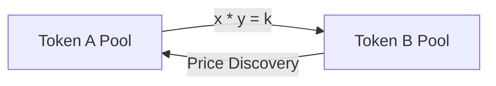
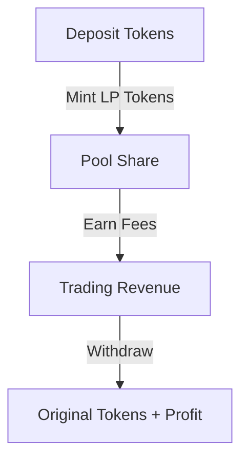

# 📖 Simple Token Exchange: Learning Guide

<div align="center">
  <h3>A Comprehensive Guide to Token Exchange Development</h3>
  <p>Learn Solana development, DeFi concepts, and smart contract security through hands-on practice</p>
</div>

---

## 📋 Table of Contents

1. [Prerequisites](#prerequisites)
2. [Core Concepts](#core-concepts)
3. [Key Components](#key-components)
4. [Study Guide](#study-guide)
5. [Hands-on Exercises](#hands-on-exercises)
6. [Resources](#resources)
7. [Advanced Topics](#advanced-topics)
8. [Learning Checklist](#learning-checklist)

---

## 🎯 Prerequisites

Before starting, ensure you have knowledge of:

```rust
// Required Foundation
struct Prerequisites {
    rust_knowledge: ["Basic syntax", "Ownership model", "Error handling"],
    solana_basics: ["Account model", "Program structure", "PDAs"],
    crypto_concepts: ["Public key cryptography", "Digital signatures"],
    defi_fundamentals: ["Liquidity pools", "Token standards", "Price discovery"]
}
```

## 🧠 Core Concepts

### 1. Solana Program Architecture

```rust
/// Core program structure with detailed annotations
pub fn process_instruction(
    program_id: &Pubkey,    // ➡️ Unique program identifier
    accounts: &[AccountInfo],// ➡️ Required account context
    instruction_data: &[u8], // ➡️ Instruction parameters
) -> ProgramResult {
    // Program logic here
}
```

### 2. Account Management

```rust
// 🔑 Program Derived Addresses (PDA)
let (pool_address, bump_seed) = Pubkey::find_program_address(
    &[b"pool", authority.key.as_ref()],
    program_id
);
```

## 🔧 Key Components

### 1. Automated Market Maker (AMM)

<div align="center">



</div>

```rust
/// Calculate token swap output with detailed explanation
fn calculate_output_amount(
    amount_in: u64,   // Amount being swapped in
    reserve_in: u64,  // Current pool reserve for input token
    reserve_out: u64, // Current pool reserve for output token
) -> u64 {
    // Constant product formula implementation
    (reserve_out * amount_in) / (reserve_in + amount_in)
}
```

### 2. Liquidity Pool Management

<div align="center">



</div>

## 📚 Study Guide

### Program Architecture Deep Dive

1. **Entry Point (`lib.rs`)**
   - Program initialization
   - Instruction processing
   - Error handling

2. **Instructions (`instruction.rs`)**
   - Command implementation
   - Parameter validation
   - Security checks

3. **State Management (`state.rs`)**
   - Account data structures
   - Serialization patterns
   - State transitions

## 🛠️ Hands-on Exercises

### Exercise 1: Pool Initialization

```typescript
// 🏊‍♂️ Create and initialize a new liquidity pool
async function initializePool() {
    // Step 1: Create pool account
    const poolAccount = await createAccount();
    
    // Step 2: Initialize pool state
    await program.rpc.initialize({
        accounts: {
            pool: poolAccount.publicKey,
            authority: wallet.publicKey,
            systemProgram: SystemProgram.programId,
        },
    });
}
```

### Exercise 2: Implementing Fees

```rust
// 💰 Custom fee calculation with safety checks
pub fn calculate_fees(
    amount: u64,
    fee_rate: u64,
) -> Result<u64, ProgramError> {
    amount
        .checked_mul(fee_rate)?
        .checked_div(10000)
        .ok_or(ProgramError::ArithmeticOverflow)
}
```

## 📚 Learning Resources

### Essential Reading

| Resource | Description | Level |
|----------|-------------|-------|
| [Solana Cookbook](https://solanacookbook.com/) | Practical examples and patterns | Beginner |
| [Anchor Framework](https://www.anchor-lang.com/) | Smart contract framework | Intermediate |
| [Uniswap V2 Paper](https://uniswap.org/whitepaper.pdf) | AMM mechanics | Advanced |

## 🔬 Advanced Topics

### Research Areas

1. **Price Oracle Integration**
   - External price feeds
   - Oracle security
   - Price update mechanics

2. **Advanced Fee Models**
   - Dynamic fee adjustment
   - Fee optimization
   - Revenue distribution

3. **Security Considerations**
   - Flash loan prevention
   - Slippage protection
   - Front-running mitigation

## ✅ Learning Checklist

### Fundamentals

- [ ] Understand Solana's account model
- [ ] Master program instruction flow
- [ ] Grasp PDAs and their usage

### DeFi Concepts

- [ ] Comprehend AMM mathematics
- [ ] Understand liquidity provision
- [ ] Master fee mechanisms

### Advanced Skills

- [ ] Implement security best practices
- [ ] Optimize for performance
- [ ] Handle program upgrades

---

<div align="center">
  <p><i>Keep this guide handy as you progress through your learning journey!</i></p>
</div>
