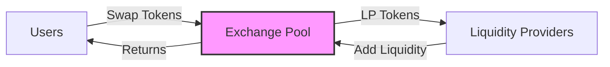

# 🔄 Simple Token Exchange Program Requirements

<div align="center">
  <h3>Technical Specification and Implementation Guide</h3>
  <p><em>A comprehensive DEX implementation on Solana blockchain</em></p>
  
  [](https://github.com/unichdonki)
  [](https://github.com/unichdonki/simple-token-exchange)
</div>

---

## 📋 Table of Contents

- [Project Overview](#-project-overview)
- [Core Features](#-core-features)
- [Technical Specifications](#-technical-specifications)
- [Learning Objectives](#-learning-objectives)
- [Security Requirements](#-security-requirements)
- [Testing Requirements](#-testing-requirements)
- [Implementation Plan](#-implementation-plan)
- [Resources & Timeline](#-resources--timeline)

---

## 🎯 Project Overview

A decentralized token exchange program built on Solana that enables:

- Seamless swaps between SOL and SPL tokens
- Automated market making using constant product formula
- Liquidity provision and management
- Secure and efficient token transfers

<div align="center">



</div>

## 🌟 Core Features

### 1. Token Pool Management

| Feature | Description | Status |
|---------|-------------|--------|
| Pool Creation | Create SOL + SPL token liquidity pool | 🟡 Pending |
| Initial Liquidity | Set up initial pool parameters | 🟡 Pending |
| State Management | PDA-based pool state storage | 🟡 Pending |

### 2. Swap Operations

| Feature | Description | Status |
|---------|-------------|--------|
| SOL → Token | Convert SOL to SPL tokens | 🟡 Pending |
| Token → SOL | Convert SPL tokens to SOL | 🟡 Pending |
| Price Formula | x * y = k implementation | 🟡 Pending |

### 3. Liquidity Features

| Feature | Description | Status |
|---------|-------------|--------|
| Add Liquidity | Deposit tokens to pool | 🟡 Pending |
| Remove Liquidity | Withdraw tokens from pool | 🟡 Pending |
| LP Tokens | Manage liquidity provider shares | 🟡 Pending |

## 💻 Technical Specifications

### Account Architecture

<details>
<summary><strong>Pool State Account</strong></summary>

```rust
/// Manages the core pool state and configuration
pub struct PoolState {
    pub authority: Pubkey,      // Pool administrator
    pub sol_reserve: u64,       // SOL balance
    pub token_reserve: u64,     // SPL token balance
    pub lp_mint: Pubkey,        // LP token mint address
    pub fee_rate: u64,          // Fee percentage (basis points)
}
```

</details>

<details>
<summary><strong>User Position Account</strong></summary>

```rust
/// Tracks individual LP positions
pub struct UserPosition {
    pub owner: Pubkey,          // LP token holder
    pub lp_tokens: u64,         // LP token balance
}
```

</details>

### Program Instructions

<details>
<summary><strong>1. Pool Initialization</strong></summary>

```rust
/// Create and initialize a new liquidity pool
pub fn initialize_pool(
    ctx: Context<InitializePool>,
    sol_amount: u64,      // Initial SOL deposit
    token_amount: u64,    // Initial token deposit
    fee_rate: u64,        // Fee rate in basis points
) -> Result<()>
```

</details>

<details>
<summary><strong>2. Token Swaps</strong></summary>

```rust
/// Execute token swap operation
pub fn swap(
    ctx: Context<Swap>,
    amount_in: u64,           // Input token amount
    minimum_amount_out: u64,  // Minimum output expected
    is_sol_input: bool,       // Swap direction flag
) -> Result<()>
```

</details>

<details>
<summary><strong>3. Liquidity Management</strong></summary>

```rust
/// Add liquidity to the pool
pub fn add_liquidity(
    ctx: Context<AddLiquidity>,
    sol_amount: u64,          // SOL to deposit
    token_amount: u64,        // Tokens to deposit
    minimum_lp_tokens: u64,   // Minimum LP tokens expected
) -> Result<()>

/// Remove liquidity from the pool
pub fn remove_liquidity(
    ctx: Context<RemoveLiquidity>,
    lp_tokens: u64,           // LP tokens to burn
    minimum_sol: u64,         // Minimum SOL expected
    minimum_token: u64,       // Minimum tokens expected
) -> Result<()>
```

</details>

## 📚 Learning Objectives

### Core Concepts

<div align="center">

| Concept | Description | Priority |
|---------|-------------|----------|
| PDAs | Program Derived Addresses usage | 🔴 High |
| SPL Tokens | Token program integration | 🔴 High |
| State Management | Program state handling | 🔴 High |
| Math | Safe token calculations | 🔴 High |
| Security | DeFi security principles | 🔴 High |

</div>

### Mathematical Models

#### Constant Product AMM

<div align="center">

\[ x *y = k \]
\[ dy = \frac{y* dx}{x + dx} \]

Where:

- x = Input reserve
- y = Output reserve
- dx = Input amount
- dy = Output amount

</div>

## 🔒 Security Requirements

### Critical Checks

| Check | Description | Implementation |
|-------|-------------|----------------|
| Overflow Protection | Prevent integer overflow/underflow | `checked_add`, `checked_mul` |
| Account Verification | Validate account ownership | Account constraint checks |
| Slippage Protection | Minimum output enforcement | Slippage tolerance checks |
| Signer Verification | Validate transaction signers | Signer constraint checks |

## 🧪 Testing Requirements

### Test Matrix

| Category | Description | Priority |
|----------|-------------|----------|
| Unit Tests | Individual instruction testing | 🔴 High |
| Integration | End-to-end flow testing | 🔴 High |
| Edge Cases | Boundary condition testing | 🟡 Medium |
| Security | Vulnerability testing | 🔴 High |

### Edge Cases

- Zero liquidity scenarios
- Minimum/maximum amounts
- Fee calculation edge cases
- Slippage boundary conditions

## 📋 Implementation Plan

### Phase 1: Foundation

- [ ] Development environment setup
- [ ] Project structure creation
- [ ] Basic program architecture

### Phase 2: Core Development

- [ ] Account structure implementation
- [ ] Pool initialization logic
- [ ] Basic swap functionality
- [ ] Liquidity management

### Phase 3: Security & Testing

- [ ] Security measure implementation
- [ ] Test suite development
- [ ] Edge case handling
- [ ] Performance optimization

### Phase 4: Documentation

- [ ] Technical documentation
- [ ] API documentation
- [ ] User guides
- [ ] Deployment guides

## 📚 Resources & Timeline

### Development Resources

| Resource | Purpose | Link |
|----------|---------|------|
| Solana Docs | Core concepts | [docs.solana.com](https://docs.solana.com/) |
| Anchor Docs | Framework guide | [anchor-lang.com](https://www.anchor-lang.com/) |
| SPL Token | Token standard | [spl.solana.com](https://spl.solana.com/token) |

### Project Timeline

| Week | Objectives | Deliverables |
|------|------------|--------------|
| 1 | Setup & Structure | Project scaffold, basic architecture |
| 2 | Core Features | Pool creation, basic swaps |
| 3 | Advanced Features | Liquidity management, security |
| 4 | Testing & Docs | Test suite, documentation |

---

<div align="center">
  <p><em>This is a living document and will be updated as the project evolves.</em></p>
  <p>Last updated: February 2024</p>
</div>
