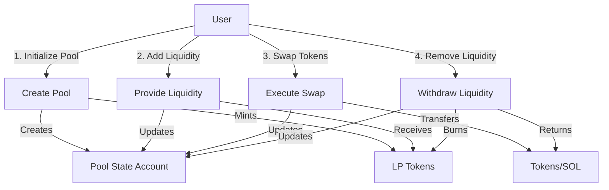
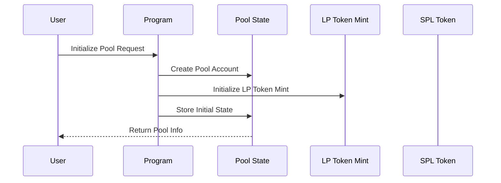
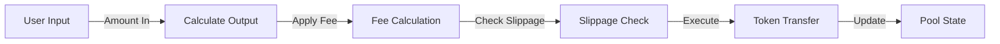
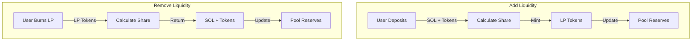
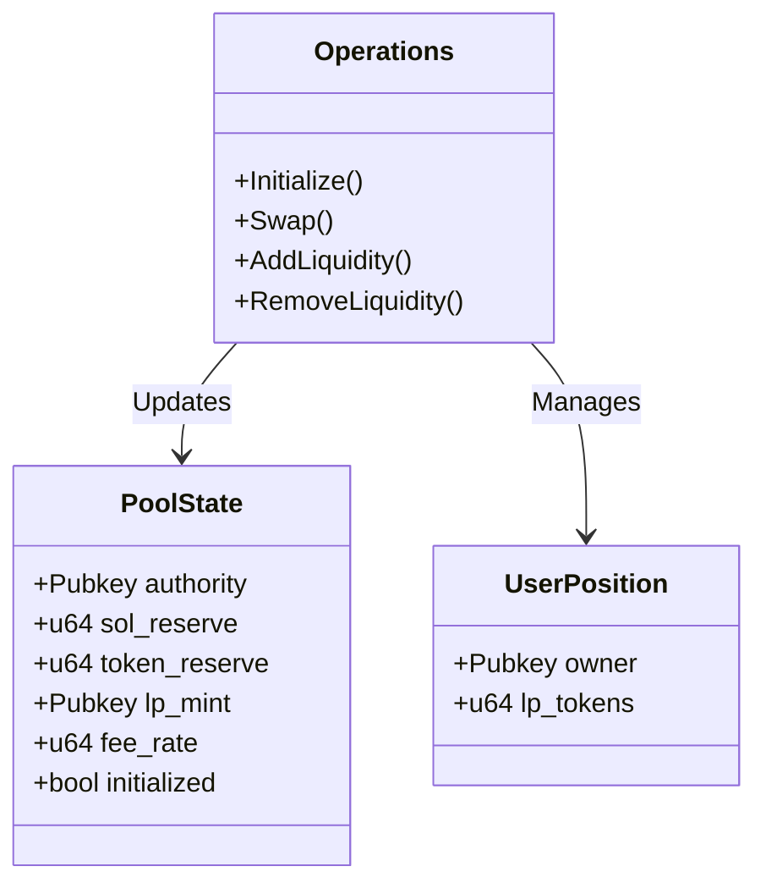
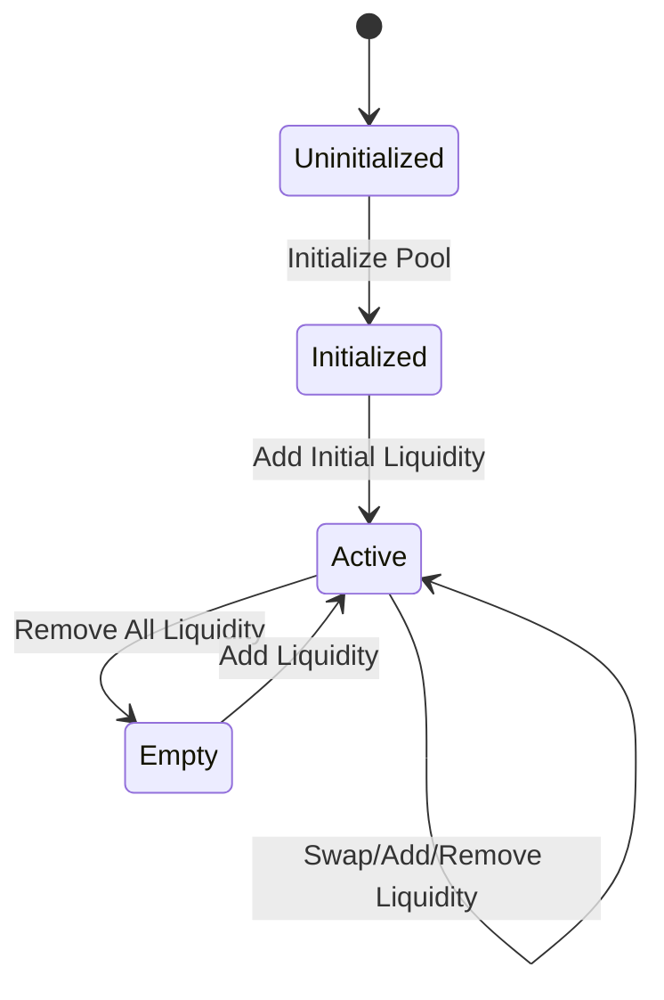

# Token Exchange Program Workflow

## Program Overview

This Solana program implements a simple token exchange (DEX) that allows users to:

* Create liquidity pools for SOL/SPL token pairs
* Add liquidity to pools
* Swap between SOL and SPL tokens
* Remove liquidity from pools

## Visual Flow Diagrams

### 1. High-Level Program Flow



### 2. Pool Initialization Flow



### 3. Swap Operation Flow



### 4. Liquidity Management Flow



### 5. Account Structure and Data Flow



### 6. Program State Transitions



## Program Architecture

### 1. Account Structure

PoolState Account:

```
+------------------+
|    PoolState     |
+------------------+
| - SOL reserve    |
| - Token reserve  |
| - LP token mint  |
| - Fee rate      |
| - Authority     |
| - Status        |
+------------------+
```

UserPosition Account:

```
+------------------+
|  UserPosition    |
+------------------+
| - Owner         |
| - LP tokens     |
+------------------+
```

### 2. Instructions

#### Initialize Pool

```rust
InitializePool {
    sol_amount: u64,    // Initial SOL amount
    token_amount: u64,  // Initial token amount
    fee_rate: u64,     // Fee rate in basis points (e.g., 30 = 0.3%)
}
```

Required accounts:

1. Signer (pool creator)
2. Pool state account (PDA)
3. Token mint
4. LP token mint
5. System program

#### Swap

```rust
Swap {
    amount_in: u64,           // Amount to swap
    minimum_amount_out: u64,  // Minimum amount to receive
    is_sol_input: bool,      // Whether SOL is input
}
```

Required accounts:

1. Signer (user)
2. Pool state account
3. User's SOL account
4. User's token account
5. Pool's token account
6. Token program

## Development Workflow

### 1. Build and Deploy

```bash
# Build the program
cargo build-sbf

# Deploy to local validator
solana program deploy target/deploy/simple_token_exchange.so
```

### 2. Test Setup

```bash
# Create test token
spl-token create-token

# Create token account
spl-token create-account <TOKEN_ADDRESS>

# Mint test tokens
spl-token mint <TOKEN_ADDRESS> <AMOUNT>
```

## Price Calculation

The program uses the constant product formula (x * y = k):

* x = SOL reserve
* y = Token reserve
* k = Constant product

For swaps:

* Output amount = (y * dx) / (x + dx)
* Where dx is input amount
* Fee is deducted from input amount before calculation

## Security Considerations

1. Overflow Protection
   * All mathematical operations use checked arithmetic
   * Large numbers are handled using u128 for intermediate calculations

2. Access Control
   * Account ownership verification
   * Signer verification for all state-changing operations

3. Slippage Protection
   * Minimum output amount check for swaps
   * Minimum LP token amount check for liquidity provision

## Testing

1. Local Testing

   ```bash
   # Start local validator
   solana-test-validator

   # Run test script
   npx ts-node tests/test-exchange.ts
   ```

2. Monitoring

   ```bash
   # Check program logs
   solana logs <PROGRAM_ID>

   # Check account info
   solana account <ACCOUNT_ADDRESS>
   ```
