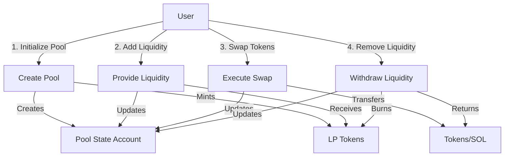
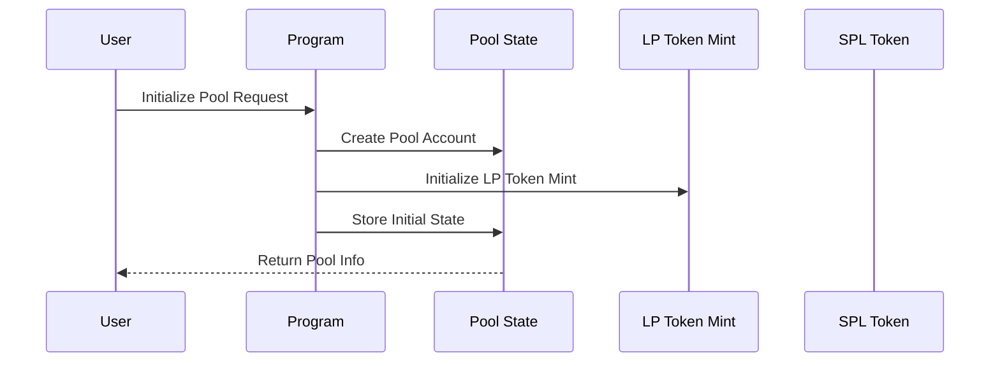
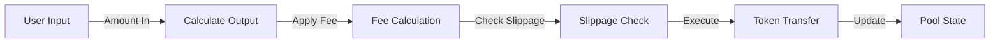
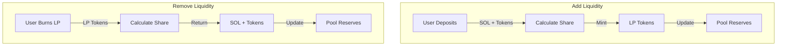
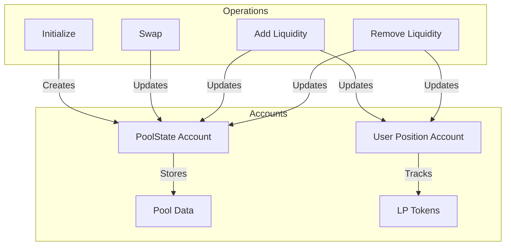

# Token Exchange Program Workflow

## Program Overview

This Solana program implements a simple token exchange (DEX) that allows users to:

- Create liquidity pools for SOL/SPL token pairs
- Add liquidity to pools
- Swap between SOL and SPL tokens
- Remove liquidity from pools

## Visual Flow Diagrams

### 1. High-Level Program Flow



### 2. Pool Initialization Flow



### 3. Swap Operation Flow



### 4. Liquidity Management Flow



## Program Architecture

### 1. Account Structure

- **PoolState Account**: Stores pool information
  - SOL reserve
  - Token reserve
  - LP token mint
  - Fee rate
  - Authority
  - Initialization status

- **User Position Account**: Tracks user's LP tokens
  - Owner
  - LP token amount

### 2. Data Flow Diagram



### 2. Instructions

#### Initialize Pool

```
